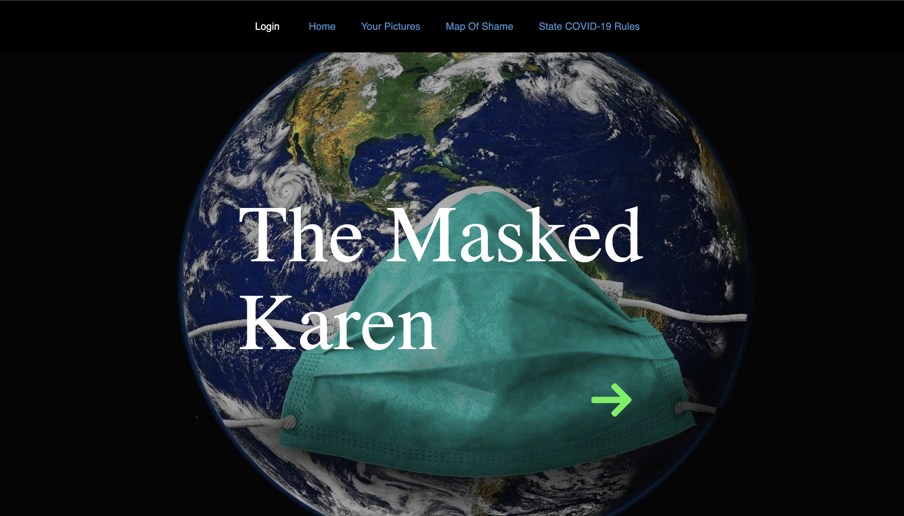

# Masked-Karen

 https://heathernev88.github.io/Masked-Karen/
 

  
  * [Description](#description)
  * [Installation](#installation)
  * [Contributing](#contributing)
  * [Tests](#tests)
  * [Questions](#questions)
  
  
## Description:
  Masked Karen is a website for Karens of all walks of life to come together and share their distaste for people not adhering to social distancing and mask wearing guidelines. On this website you can report establishments that aren't adhering to COVID-19 rules as well as add images of said places, or on the other hand praise establishments that are doing a good job of implementing rules and keeping us all safe. Also feel free to send us pictures of you and your family/friends wearing your masks and you could be featured in our "Your Pictures" page!

## Installation
    1. Download repo
    2. Run "npm install" to install dependencies
    3. Run "npm start"
## License

	This is free and unencumbered software released into the public domain.

    Anyone is free to copy, modify, publish, use, compile, sell, or
    distribute this software, either in source code form or as a compiled
    binary, for any purpose, commercial or non-commercial, and by any
    means.

    In jurisdictions that recognize copyright laws, the author or authors
    of this software dedicate any and all copyright interest in the
    software to the public domain. We make this dedication for the benefit
    of the public at large and to the detriment of our heirs and
    successors. We intend this dedication to be an overt act of
    relinquishment in perpetuity of all present and future rights to this
    software under copyright law.

    THE SOFTWARE IS PROVIDED "AS IS", WITHOUT WARRANTY OF ANY KIND,
    EXPRESS OR IMPLIED, INCLUDING BUT NOT LIMITED TO THE WARRANTIES OF
    MERCHANTABILITY, FITNESS FOR A PARTICULAR PURPOSE AND NONINFRINGEMENT.
    IN NO EVENT SHALL THE AUTHORS BE LIABLE FOR ANY CLAIM, DAMAGES OR
    OTHER LIABILITY, WHETHER IN AN ACTION OF CONTRACT, TORT OR OTHERWISE,
    ARISING FROM, OUT OF OR IN CONNECTION WITH THE SOFTWARE OR THE USE OR
    OTHER DEALINGS IN THE SOFTWARE.

    For more information, please refer to <https://unlicense.org>

## 4. Contributing

  + [Heather Nevarez](https://github.com/heathernev88)
  + [Alexandra Vick](https://github.com/astout)
  + [Marina Cherevach](https://github.com/mcherevach)
  + [Paul Sun](https://github.com/LostandConfusedStudent)

## 5. Tests

  No tests currently associated

## 6. Questions

  Please feel free to contact any of the above contributors with any questions or feedback you have. Constructive criticism is always appreciated!